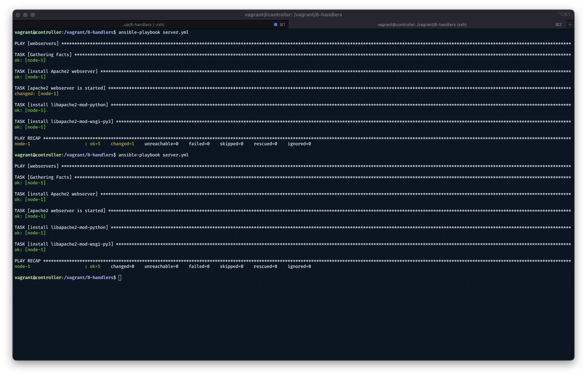

# Handlers

Handlers allow us to respond to events occuring at some point on the playbook.

Scenario:

Installing the Apache Web Server. When installed make sure the web server is started.

Need ability to run Python scripts, run WSGI, requires addition of extensions to Apache Web Server.

Need WSGI style applications that Apache is moderating.

To install those, Apache needs to be restarted, or enabled, or a combination of.

Only restart Apache if only these extensions werent already detected as being present.

When installing extensions, run a task that only executes if the original execution task runs, a dependent task.

Reactive in nature.

## How to create a handler?

Base Ansible playbook

```yaml
--- # demonstrates handlers

- hosts: webservers
  become: true
  tasks:
    - name: "install Apache2 webserver"
      apt:
        name: apache2
        state: present
    - name: "apache2 webserver is started"
      service:
        name: apache2
        state: started
    - name: "install libapache2-mod-python"
      apt:
        name: libapache2-mod-python
        state: present
    - name: "restart apache2 webserver"
      service:
        name: apache2
        state: restarted
    - name: "install libapache2-mod-wsgi-py3"
      apt:
        name: libapache2-mod-wsgi-py3
        state: present
    - name: "restart apache2 webserver"
      service:
        name: apache2
        state: restarted
```

🕳 By this time, on Ubuntu 21.10 at least, `libapache2-mod-wsgi` is not available and replaced by `libapache2-mod-wsgi-py3`
🕳 Encountered port not available. Fount out that the port 80 is already acquired by nginx from previous runs. Just stopped nginx.
🕳 Another error encountered is below. Need to add `ServerName 127.0.0.1`in `/etc/apache2/apache2.conf`. More info here — https://www.digitalocean.com/community/tutorials/apache-configuration-error-ah00558-could-not-reliably-determine-the-server-s-fully-qualified-domain-name

Now, for the last two, I'm not sure how to handle it in Ansible (yet).

🕳 Got ` apachectl[5304]: Action 'start' failed.`More info here — https://support.plesk.com/hc/en-us/articles/115002784134-Plesk-web-server-reconfiguration-fails-on-Debian-Ubuntu-with-Plesk-Curl-failed-Timeout-was-reached

```
vagrant@node-1:~$ sudo tail -n 2 /var/log/apache2/error.log
[Mon Jan 17 13:44:00.245141 2022] [wsgi:crit] [pid 5622:tid 281473337098256] mod_wsgi (pid=5622): The mod_python module can not be used in conjunction with mod_wsgi 4.0+. Remove the mod_python module from the Apache configuration.
AH00016: Configuration Failed
```

Need to disable `mod_python` first.

```
vagrant@node-1:~$ sudo vim /etc/apache2/mods-available/python.load
vagrant@node-1:~$ cat /etc/apache2/mods-available/python.load
#LoadModule python_module /usr/lib/apache2/modules/mod_python.so
vagrant@node-1:~$ sudo service apache2 restart
vagrant@node-1:~$ sudo service apache2 status
● apache2.service - The Apache HTTP Server
     Loaded: loaded (/lib/systemd/system/apache2.service; enabled; vendor preset: enabled)
     Active: active (running) since Mon 2022-01-17 13:48:12 UTC; 3s ago
       Docs: https://httpd.apache.org/docs/2.4/
    Process: 5721 ExecStart=/usr/sbin/apachectl start (code=exited, status=0/SUCCESS)
   Main PID: 5725 (apache2)
      Tasks: 55 (limit: 436)
     Memory: 15.6M
        CPU: 46ms
     CGroup: /system.slice/apache2.service
             ├─5725 /usr/sbin/apache2 -k start
             ├─5726 /usr/sbin/apache2 -k start
             └─5727 /usr/sbin/apache2 -k start

Jan 17 13:48:12 node-1 systemd[1]: Starting The Apache HTTP Server...
Jan 17 13:48:12 node-1 systemd[1]: Started The Apache HTTP Server.
vagrant@node-1:~$
```

Finally.

```
vagrant@controller:/vagrant/8-handlers$ ansible-playbook server.yml

PLAY [webservers] ****************************************************************************************************************************************************************************************************

TASK [Gathering Facts] ***********************************************************************************************************************************************************************************************
ok: [node-1]

TASK [install Apache2 webserver] *************************************************************************************************************************************************************************************
ok: [node-1]

TASK [apache2 webserver is started] **********************************************************************************************************************************************************************************
ok: [node-1]

TASK [install libapache2-mod-python] *********************************************************************************************************************************************************************************
ok: [node-1]

TASK [restart apache2 webserver] *************************************************************************************************************************************************************************************
changed: [node-1]

TASK [install libapache2-mod-wsgi-py3] *******************************************************************************************************************************************************************************
ok: [node-1]

TASK [restart apache2 webserver] *************************************************************************************************************************************************************************************
changed: [node-1]

PLAY RECAP ***********************************************************************************************************************************************************************************************************
node-1                     : ok=7    changed=2    unreachable=0    failed=0    skipped=0    rescued=0    ignored=0

vagrant@controller:/vagrant/8-handlers$
```

## Using handlers

Don't want to run everytime. Only restart to occur if not already been installed.

Unless this other thing happen, only react when things happen.

Two restarts? Not necessary. Only when the dependencies are not installed.

How does one create handlers?

```yaml
--- # demonstrates handlers

- hosts: webservers
  become: true
  handlers:  # handlers section here
    - name: "restart apache2"
      service:
        name: apache2
        state: restarted
  tasks:
    - name: "install Apache2 webserver"
      apt:
        name: apache2
        state: present
    - name: "apache2 webserver is started"
      service:
        name: apache2
        state: started
    - name: "install libapache2-mod-python"
      apt:
        name: libapache2-mod-python
        state: present
      notify:
        - "restart apache2"  # can be a list of handlers
    - name: "install libapache2-mod-wsgi-py3"
      apt:
        name: libapache2-mod-wsgi-py3
        state: present
      notify: "restart apache2"  # use the same name from handlers section
```



At the end of the re-run, no handlers ran because it didn't have to make any changes.

That's great, makes deployment faster. No unnecessary downtime due to restart.

What if I user configurations needed to be updated too? 💡 _Is this the part where I don't have to manually edit the configurations?_ 

```yaml
--- # demonstrates handlers

- hosts: webservers
  become: true
  handlers:
    - name: "restart apache2"
      service:
        name: apache2
        state: restarted
    - name: "add new user configuration"
      file:
        path: /tmp/user.conf
        state: touch
  tasks:
    - name: "install Apache2 webserver"
      apt:
        name: apache2
        state: present
    - name: "apache2 webserver is started"
      service:
        name: apache2
        state: started
    - name: "install libapache2-mod-python"
      apt:
        name: libapache2-mod-python
        state: present
      notify: "restart apache2"    # use the same name from handlers section
    - name: "install libapache2-mod-wsgi-py3"
      apt:
        name: libapache2-mod-wsgi-py3
        state: present
      notify:
        - "restart apache2"    # can be a list of handlers
        - "add new user configuration"
```

```
vagrant@controller:/vagrant/8-handlers$ ansible-playbook server.yml

PLAY [webservers] ****************************************************************************************************************************************************************************************************

TASK [Gathering Facts] ***********************************************************************************************************************************************************************************************
ok: [node-1]

TASK [install Apache2 webserver] *************************************************************************************************************************************************************************************
ok: [node-1]

TASK [apache2 webserver is started] **********************************************************************************************************************************************************************************
ok: [node-1]

TASK [install libapache2-mod-python] *********************************************************************************************************************************************************************************
ok: [node-1]

TASK [install libapache2-mod-wsgi-py3] *******************************************************************************************************************************************************************************
changed: [node-1]

RUNNING HANDLER [restart apache2] ************************************************************************************************************************************************************************************
changed: [node-1]

RUNNING HANDLER [add new user configuration] *************************************************************************************************************************************************************************
changed: [node-1]

PLAY RECAP ***********************************************************************************************************************************************************************************************************
node-1                     : ok=7    changed=3    unreachable=0    failed=0    skipped=0    rescued=0    ignored=0

vagrant@controller:/vagrant/8-handlers$
```

But there are cases where restarting apache2 and adding the configuration always comes together. Need a composite handler.

```yaml
--- # demonstrates handlers

- hosts: webservers
  become: true
  handlers:
    - name: "add new user configuration"
      file:
        path: /tmp/user.conf
        state: touch
      listen: "update web services"  # listen!
    - name: "restart apache2"
      service:
        name: apache2
        state: restarted
      listen: "update web services"  # listen!
  tasks:
    - name: "install Apache2 webserver"
      apt:
        name: apache2
        state: present
    - name: "apache2 webserver is started"
      service:
        name: apache2
        state: started
    - name: "install libapache2-mod-python"
      apt:
        name: libapache2-mod-python
        state: present
      notify: "update web services"    # now a composite handler
    - name: "install libapache2-mod-wsgi-py3"
      apt:
        name: libapache2-mod-wsgi-py3
        state: present
      notify: "update web services"
```

Notes:  

- Very much context specific to the application.
- Uses `listen` to treat the handlers composite of each other. Groupings based on `listen` within handlers.
- Execution follows the order in which they are defined
- Only run when the actual task runs.
- Change state occurs, handlers run. OK state, handlers will NOT run.
  - There are ways to force the modification of the behavior.
  - BUT in general, don't work against the tooling. Work with the tooling.

```
vagrant@controller:/vagrant/8-handlers$ ansible-playbook server.yml

PLAY [webservers] ****************************************************************************************************************************************************************************************************

TASK [Gathering Facts] ***********************************************************************************************************************************************************************************************
ok: [node-1]

TASK [install Apache2 webserver] *************************************************************************************************************************************************************************************
ok: [node-1]

TASK [apache2 webserver is started] **********************************************************************************************************************************************************************************
ok: [node-1]

TASK [install libapache2-mod-python] *********************************************************************************************************************************************************************************
ok: [node-1]

TASK [install libapache2-mod-wsgi-py3] *******************************************************************************************************************************************************************************
changed: [node-1]

RUNNING HANDLER [add new user configuration] *************************************************************************************************************************************************************************
changed: [node-1]

RUNNING HANDLER [restart apache2] ************************************************************************************************************************************************************************************
changed: [node-1]

PLAY RECAP ***********************************************************************************************************************************************************************************************************
node-1                     : ok=7    changed=3    unreachable=0    failed=0    skipped=0    rescued=0    ignored=0

vagrant@controller:/vagrant/8-handlers$
```

## General tips

1. Make everything a task
2. Get stuff working
3. Create handlers as reponses to the tasks (again context specific to your application)
