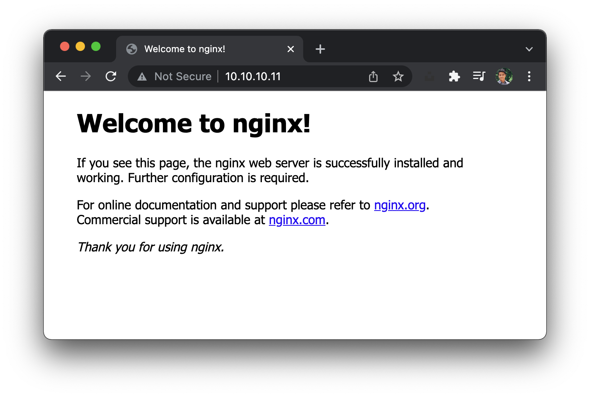

# Command line


## Installing Packages

Installing packages on multiple servers. Maybe SSH into one of them and setup. 
But prone to mistakes, say you might SSH into an already setup one. Not a long term solution.

Getting back to the hosts, we can see groupings by role

```
[webservers]
node-1

[dbservers]
node-2
```

We would want to install Nginx on webservers. Using the `apt` module


🕳  unreachable, cant ping 8.8.8.8
`vagrant reload`

```
vagrant@controller:/vagrant/3-command-line$ ansible webservers -m apt -a "name=nginx state=present" --become
node-1 | CHANGED => {
    "ansible_facts": {
        "discovered_interpreter_python": "/usr/bin/python3"
    },
    "cache_update_time": 1636886285,
    "cache_updated": false,
    "changed": true,
    "stderr": "",
    "stderr_lines": [],
    "stdout": "Reading package lists...\nBuilding dependency tree...\nReading state information...\nThe following additional packages will be installed:\n  fontconfig-config fonts-dejavu-core libdeflate0 libfontconfig1 libgd3\n  libjbig0 libjpeg-turbo8 libjpeg8 libnginx-mod-http-geoip2\n  libnginx-mod-http-image-filter libnginx-mod-http-xslt-filter\n  libnginx-mod-mail libnginx-mod-stream libnginx-mod-stream-geoip2 libtiff5\n  libwebp6 libxpm4 nginx-common nginx-core\nSuggested packages:\n  libgd-tools fcgiwrap nginx-doc ssl-cert\nThe following NEW packages will be installed:\n  fontconfig-config fonts-dejavu-core libdeflate0 libfontconfig1 libgd3\n  libjbig0 libjpeg-turbo8 libjpeg8 libnginx-mod-http-geoip2\n  libnginx-mod-http-image-filter libnginx-mod-http-xslt-filter\n  libnginx-mod-mail libnginx-mod-stream libnginx-mod-stream-geoip2 libtiff5\n  libwebp6 libxpm4 nginx nginx-common nginx-core\n0 upgraded, 20 newly installed, 0 to remove and 0 not upgraded.\nNeed to get 2,542 kB of archives.\nAfter this operation, 7,733 kB of additional disk space will be used.\nGet:1 http://de.ports.ubuntu.com/ubuntu-ports impish/main arm64 fonts-dejavu-core all 2.37-2build1 [1,041 kB]\nGet:2 http://de.ports.ubuntu.com/ubuntu-ports impish/main arm64 fontconfig-config all 2.13.1-4.2ubuntu3 [28.2 kB]\nGet:3 http://de.ports.ubuntu.com/ubuntu-ports impish/main arm64 libdeflate0 arm64 1.7-2ubuntu2 [53.1 kB]\nGet:4 http://de.ports.ubuntu.com/ubuntu-ports impish/main arm64 libfontconfig1 arm64 2.13.1-4.2ubuntu3 [113 kB]\nGet:5 http://de.ports.ubuntu.com/ubuntu-ports impish/main arm64 libjpeg-turbo8 arm64 2.0.6-0ubuntu2 [99.9 kB]\nGet:6 http://de.ports.ubuntu.com/ubuntu-ports impish/main arm64 libjpeg8 arm64 8c-2ubuntu8 [2,198 B]\nGet:7 http://de.ports.ubuntu.com/ubuntu-ports impish/main arm64 libjbig0 arm64 2.1-3.1build1 [24.0 kB]\nGet:8 http://de.ports.ubuntu.com/ubuntu-ports impish/main arm64 libwebp6 arm64 0.6.1-2.1 [164 kB]\nGet:9 http://de.ports.ubuntu.com/ubuntu-ports impish/main arm64 libtiff5 arm64 4.3.0-1 [155 kB]\nGet:10 http://de.ports.ubuntu.com/ubuntu-ports impish/main arm64 libxpm4 arm64 1:3.5.12-1 [28.8 kB]\nGet:11 http://de.ports.ubuntu.com/ubuntu-ports impish/main arm64 libgd3 arm64 2.3.0-2ubuntu1 [126 kB]\nGet:12 http://de.ports.ubuntu.com/ubuntu-ports impish/main arm64 nginx-common all 1.18.0-6ubuntu11 [40.3 kB]\nGet:13 http://de.ports.ubuntu.com/ubuntu-ports impish/main arm64 libnginx-mod-http-geoip2 arm64 1.18.0-6ubuntu11 [11.9 kB]\nGet:14 http://de.ports.ubuntu.com/ubuntu-ports impish/main arm64 libnginx-mod-http-image-filter arm64 1.18.0-6ubuntu11 [15.2 kB]\nGet:15 http://de.ports.ubuntu.com/ubuntu-ports impish/main arm64 libnginx-mod-http-xslt-filter arm64 1.18.0-6ubuntu11 [13.9 kB]\nGet:16 http://de.ports.ubuntu.com/ubuntu-ports impish/main arm64 libnginx-mod-mail arm64 1.18.0-6ubuntu11 [45.2 kB]\nGet:17 http://de.ports.ubuntu.com/ubuntu-ports impish/main arm64 libnginx-mod-stream arm64 1.18.0-6ubuntu11 [72.6 kB]\nGet:18 http://de.ports.ubuntu.com/ubuntu-ports impish/main arm64 libnginx-mod-stream-geoip2 arm64 1.18.0-6ubuntu11 [9,876 B]\nGet:19 http://de.ports.ubuntu.com/ubuntu-ports impish/main arm64 nginx-core arm64 1.18.0-6ubuntu11 [494 kB]\nGet:20 http://de.ports.ubuntu.com/ubuntu-ports impish/main arm64 nginx arm64 1.18.0-6ubuntu11 [3,880 B]\nPreconfiguring packages ...\nFetched 2,542 kB in 6s (407 kB/s)\nSelecting previously unselected package fonts-dejavu-core.\r\n(Reading database ... \r(Reading database ... 5%\r(Reading database ... 10%\r(Reading database ... 15%\r(Reading database ... 20%\r(Reading database ... 25%\r(Reading database ... 30%\r(Reading database ... 35%\r(Reading database ... 40%\r(Reading database ... 45%\r(Reading database ... 50%\r(Reading database ... 55%\r(Reading database ... 60%\r(Reading database ... 65%\r(Reading database ... 70%\r(Reading database ... 75%\r(Reading database ... 80%\r(Reading database ... 85%\r(Reading database ... 90%\r(Reading database ... 95%\r(Reading database ... 100%\r(Reading database ... 73306 files and directories currently installed.)\r\nPreparing to unpack .../00-fonts-dejavu-core_2.37-2build1_all.deb ...\r\nUnpacking fonts-dejavu-core (2.37-2build1) ...\r\nSelecting previously unselected package fontconfig-config.\r\nPreparing to unpack .../01-fontconfig-config_2.13.1-4.2ubuntu3_all.deb ...\r\nUnpacking fontconfig-config (2.13.1-4.2ubuntu3) ...\r\nSelecting previously unselected package libdeflate0:arm64.\r\nPreparing to unpack .../02-libdeflate0_1.7-2ubuntu2_arm64.deb ...\r\nUnpacking libdeflate0:arm64 (1.7-2ubuntu2) ...\r\nSelecting previously unselected package libfontconfig1:arm64.\r\nPreparing to unpack .../03-libfontconfig1_2.13.1-4.2ubuntu3_arm64.deb ...\r\nUnpacking libfontconfig1:arm64 (2.13.1-4.2ubuntu3) ...\r\nSelecting previously unselected package libjpeg-turbo8:arm64.\r\nPreparing to unpack .../04-libjpeg-turbo8_2.0.6-0ubuntu2_arm64.deb ...\r\nUnpacking libjpeg-turbo8:arm64 (2.0.6-0ubuntu2) ...\r\nSelecting previously unselected package libjpeg8:arm64.\r\nPreparing to unpack .../05-libjpeg8_8c-2ubuntu8_arm64.deb ...\r\nUnpacking libjpeg8:arm64 (8c-2ubuntu8) ...\r\nSelecting previously unselected package libjbig0:arm64.\r\nPreparing to unpack .../06-libjbig0_2.1-3.1build1_arm64.deb ...\r\nUnpacking libjbig0:arm64 (2.1-3.1build1) ...\r\nSelecting previously unselected package libwebp6:arm64.\r\nPreparing to unpack .../07-libwebp6_0.6.1-2.1_arm64.deb ...\r\nUnpacking libwebp6:arm64 (0.6.1-2.1) ...\r\nSelecting previously unselected package libtiff5:arm64.\r\nPreparing to unpack .../08-libtiff5_4.3.0-1_arm64.deb ...\r\nUnpacking libtiff5:arm64 (4.3.0-1) ...\r\nSelecting previously unselected package libxpm4:arm64.\r\nPreparing to unpack .../09-libxpm4_1%3a3.5.12-1_arm64.deb ...\r\nUnpacking libxpm4:arm64 (1:3.5.12-1) ...\r\nSelecting previously unselected package libgd3:arm64.\r\nPreparing to unpack .../10-libgd3_2.3.0-2ubuntu1_arm64.deb ...\r\nUnpacking libgd3:arm64 (2.3.0-2ubuntu1) ...\r\nSelecting previously unselected package nginx-common.\r\nPreparing to unpack .../11-nginx-common_1.18.0-6ubuntu11_all.deb ...\r\nUnpacking nginx-common (1.18.0-6ubuntu11) ...\r\nSelecting previously unselected package libnginx-mod-http-geoip2.\r\nPreparing to unpack .../12-libnginx-mod-http-geoip2_1.18.0-6ubuntu11_arm64.deb ...\r\nUnpacking libnginx-mod-http-geoip2 (1.18.0-6ubuntu11) ...\r\nSelecting previously unselected package libnginx-mod-http-image-filter.\r\nPreparing to unpack .../13-libnginx-mod-http-image-filter_1.18.0-6ubuntu11_arm64.deb ...\r\nUnpacking libnginx-mod-http-image-filter (1.18.0-6ubuntu11) ...\r\nSelecting previously unselected package libnginx-mod-http-xslt-filter.\r\nPreparing to unpack .../14-libnginx-mod-http-xslt-filter_1.18.0-6ubuntu11_arm64.deb ...\r\nUnpacking libnginx-mod-http-xslt-filter (1.18.0-6ubuntu11) ...\r\nSelecting previously unselected package libnginx-mod-mail.\r\nPreparing to unpack .../15-libnginx-mod-mail_1.18.0-6ubuntu11_arm64.deb ...\r\nUnpacking libnginx-mod-mail (1.18.0-6ubuntu11) ...\r\nSelecting previously unselected package libnginx-mod-stream.\r\nPreparing to unpack .../16-libnginx-mod-stream_1.18.0-6ubuntu11_arm64.deb ...\r\nUnpacking libnginx-mod-stream (1.18.0-6ubuntu11) ...\r\nSelecting previously unselected package libnginx-mod-stream-geoip2.\r\nPreparing to unpack .../17-libnginx-mod-stream-geoip2_1.18.0-6ubuntu11_arm64.deb ...\r\nUnpacking libnginx-mod-stream-geoip2 (1.18.0-6ubuntu11) ...\r\nSelecting previously unselected package nginx-core.\r\nPreparing to unpack .../18-nginx-core_1.18.0-6ubuntu11_arm64.deb ...\r\nUnpacking nginx-core (1.18.0-6ubuntu11) ...\r\nSelecting previously unselected package nginx.\r\nPreparing to unpack .../19-nginx_1.18.0-6ubuntu11_arm64.deb ...\r\nUnpacking nginx (1.18.0-6ubuntu11) ...\r\nSetting up libxpm4:arm64 (1:3.5.12-1) ...\r\nSetting up libdeflate0:arm64 (1.7-2ubuntu2) ...\r\nSetting up nginx-common (1.18.0-6ubuntu11) ...\r\nCreated symlink /etc/systemd/system/multi-user.target.wants/nginx.service → /lib/systemd/system/nginx.service.\r\nSetting up libjbig0:arm64 (2.1-3.1build1) ...\r\nSetting up libnginx-mod-http-xslt-filter (1.18.0-6ubuntu11) ...\r\nSetting up libwebp6:arm64 (0.6.1-2.1) ...\r\nSetting up fonts-dejavu-core (2.37-2build1) ...\r\nSetting up libjpeg-turbo8:arm64 (2.0.6-0ubuntu2) ...\r\nSetting up libnginx-mod-http-geoip2 (1.18.0-6ubuntu11) ...\r\nSetting up libjpeg8:arm64 (8c-2ubuntu8) ...\r\nSetting up libnginx-mod-mail (1.18.0-6ubuntu11) ...\r\nSetting up fontconfig-config (2.13.1-4.2ubuntu3) ...\r\nSetting up libnginx-mod-stream (1.18.0-6ubuntu11) ...\r\nSetting up libtiff5:arm64 (4.3.0-1) ...\r\nSetting up libfontconfig1:arm64 (2.13.1-4.2ubuntu3) ...\r\nSetting up libnginx-mod-stream-geoip2 (1.18.0-6ubuntu11) ...\r\nSetting up libgd3:arm64 (2.3.0-2ubuntu1) ...\r\nSetting up libnginx-mod-http-image-filter (1.18.0-6ubuntu11) ...\r\nSetting up nginx-core (1.18.0-6ubuntu11) ...\r\n * Upgrading binary nginx       \u001b[80G \r\u001b[74G[ OK ]\r\nSetting up nginx (1.18.0-6ubuntu11) ...\r\nProcessing triggers for ufw (0.36.1-1ubuntu1) ...\r\nProcessing triggers for man-db (2.9.4-2) ...\r\nProcessing triggers for libc-bin (2.34-0ubuntu3) ...\r\nNEEDRESTART-VER: 3.5\nNEEDRESTART-KCUR: 5.13.0-21-generic\nNEEDRESTART-KEXP: 5.13.0-21-generic\nNEEDRESTART-KSTA: 1\n",
    "stdout_lines": [
        "Reading package lists...",
        "Building dependency tree...",
        "Reading state information...",
        "The following additional packages will be installed:",
        "  fontconfig-config fonts-dejavu-core libdeflate0 libfontconfig1 libgd3",
        "  libjbig0 libjpeg-turbo8 libjpeg8 libnginx-mod-http-geoip2",
        "  libnginx-mod-http-image-filter libnginx-mod-http-xslt-filter",
        "  libnginx-mod-mail libnginx-mod-stream libnginx-mod-stream-geoip2 libtiff5",
        "  libwebp6 libxpm4 nginx-common nginx-core",
        "Suggested packages:",
        "  libgd-tools fcgiwrap nginx-doc ssl-cert",
        "The following NEW packages will be installed:",
        "  fontconfig-config fonts-dejavu-core libdeflate0 libfontconfig1 libgd3",
        "  libjbig0 libjpeg-turbo8 libjpeg8 libnginx-mod-http-geoip2",
        "  libnginx-mod-http-image-filter libnginx-mod-http-xslt-filter",
        "  libnginx-mod-mail libnginx-mod-stream libnginx-mod-stream-geoip2 libtiff5",
        "  libwebp6 libxpm4 nginx nginx-common nginx-core",
        "0 upgraded, 20 newly installed, 0 to remove and 0 not upgraded.",
        "Need to get 2,542 kB of archives.",
        "After this operation, 7,733 kB of additional disk space will be used.",
        "Get:1 http://de.ports.ubuntu.com/ubuntu-ports impish/main arm64 fonts-dejavu-core all 2.37-2build1 [1,041 kB]",
        "Get:2 http://de.ports.ubuntu.com/ubuntu-ports impish/main arm64 fontconfig-config all 2.13.1-4.2ubuntu3 [28.2 kB]",
        "Get:3 http://de.ports.ubuntu.com/ubuntu-ports impish/main arm64 libdeflate0 arm64 1.7-2ubuntu2 [53.1 kB]",
        "Get:4 http://de.ports.ubuntu.com/ubuntu-ports impish/main arm64 libfontconfig1 arm64 2.13.1-4.2ubuntu3 [113 kB]",
        "Get:5 http://de.ports.ubuntu.com/ubuntu-ports impish/main arm64 libjpeg-turbo8 arm64 2.0.6-0ubuntu2 [99.9 kB]",
        "Get:6 http://de.ports.ubuntu.com/ubuntu-ports impish/main arm64 libjpeg8 arm64 8c-2ubuntu8 [2,198 B]",
        "Get:7 http://de.ports.ubuntu.com/ubuntu-ports impish/main arm64 libjbig0 arm64 2.1-3.1build1 [24.0 kB]",
        "Get:8 http://de.ports.ubuntu.com/ubuntu-ports impish/main arm64 libwebp6 arm64 0.6.1-2.1 [164 kB]",
        "Get:9 http://de.ports.ubuntu.com/ubuntu-ports impish/main arm64 libtiff5 arm64 4.3.0-1 [155 kB]",
        "Get:10 http://de.ports.ubuntu.com/ubuntu-ports impish/main arm64 libxpm4 arm64 1:3.5.12-1 [28.8 kB]",
        "Get:11 http://de.ports.ubuntu.com/ubuntu-ports impish/main arm64 libgd3 arm64 2.3.0-2ubuntu1 [126 kB]",
        "Get:12 http://de.ports.ubuntu.com/ubuntu-ports impish/main arm64 nginx-common all 1.18.0-6ubuntu11 [40.3 kB]",
        "Get:13 http://de.ports.ubuntu.com/ubuntu-ports impish/main arm64 libnginx-mod-http-geoip2 arm64 1.18.0-6ubuntu11 [11.9 kB]",
        "Get:14 http://de.ports.ubuntu.com/ubuntu-ports impish/main arm64 libnginx-mod-http-image-filter arm64 1.18.0-6ubuntu11 [15.2 kB]",
        "Get:15 http://de.ports.ubuntu.com/ubuntu-ports impish/main arm64 libnginx-mod-http-xslt-filter arm64 1.18.0-6ubuntu11 [13.9 kB]",
        "Get:16 http://de.ports.ubuntu.com/ubuntu-ports impish/main arm64 libnginx-mod-mail arm64 1.18.0-6ubuntu11 [45.2 kB]",
        "Get:17 http://de.ports.ubuntu.com/ubuntu-ports impish/main arm64 libnginx-mod-stream arm64 1.18.0-6ubuntu11 [72.6 kB]",
        "Get:18 http://de.ports.ubuntu.com/ubuntu-ports impish/main arm64 libnginx-mod-stream-geoip2 arm64 1.18.0-6ubuntu11 [9,876 B]",
        "Get:19 http://de.ports.ubuntu.com/ubuntu-ports impish/main arm64 nginx-core arm64 1.18.0-6ubuntu11 [494 kB]",
        "Get:20 http://de.ports.ubuntu.com/ubuntu-ports impish/main arm64 nginx arm64 1.18.0-6ubuntu11 [3,880 B]",
        "Preconfiguring packages ...",
        "Fetched 2,542 kB in 6s (407 kB/s)",
        "Selecting previously unselected package fonts-dejavu-core.",
        "(Reading database ... ",
        "(Reading database ... 5%",
        "(Reading database ... 10%",
        "(Reading database ... 15%",
        "(Reading database ... 20%",
        "(Reading database ... 25%",
        "(Reading database ... 30%",
        "(Reading database ... 35%",
        "(Reading database ... 40%",
        "(Reading database ... 45%",
        "(Reading database ... 50%",
        "(Reading database ... 55%",
        "(Reading database ... 60%",
        "(Reading database ... 65%",
        "(Reading database ... 70%",
        "(Reading database ... 75%",
        "(Reading database ... 80%",
        "(Reading database ... 85%",
        "(Reading database ... 90%",
        "(Reading database ... 95%",
        "(Reading database ... 100%",
        "(Reading database ... 73306 files and directories currently installed.)",
        "Preparing to unpack .../00-fonts-dejavu-core_2.37-2build1_all.deb ...",
        "Unpacking fonts-dejavu-core (2.37-2build1) ...",
        "Selecting previously unselected package fontconfig-config.",
        "Preparing to unpack .../01-fontconfig-config_2.13.1-4.2ubuntu3_all.deb ...",
        "Unpacking fontconfig-config (2.13.1-4.2ubuntu3) ...",
        "Selecting previously unselected package libdeflate0:arm64.",
        "Preparing to unpack .../02-libdeflate0_1.7-2ubuntu2_arm64.deb ...",
        "Unpacking libdeflate0:arm64 (1.7-2ubuntu2) ...",
        "Selecting previously unselected package libfontconfig1:arm64.",
        "Preparing to unpack .../03-libfontconfig1_2.13.1-4.2ubuntu3_arm64.deb ...",
        "Unpacking libfontconfig1:arm64 (2.13.1-4.2ubuntu3) ...",
        "Selecting previously unselected package libjpeg-turbo8:arm64.",
        "Preparing to unpack .../04-libjpeg-turbo8_2.0.6-0ubuntu2_arm64.deb ...",
        "Unpacking libjpeg-turbo8:arm64 (2.0.6-0ubuntu2) ...",
        "Selecting previously unselected package libjpeg8:arm64.",
        "Preparing to unpack .../05-libjpeg8_8c-2ubuntu8_arm64.deb ...",
        "Unpacking libjpeg8:arm64 (8c-2ubuntu8) ...",
        "Selecting previously unselected package libjbig0:arm64.",
        "Preparing to unpack .../06-libjbig0_2.1-3.1build1_arm64.deb ...",
        "Unpacking libjbig0:arm64 (2.1-3.1build1) ...",
        "Selecting previously unselected package libwebp6:arm64.",
        "Preparing to unpack .../07-libwebp6_0.6.1-2.1_arm64.deb ...",
        "Unpacking libwebp6:arm64 (0.6.1-2.1) ...",
        "Selecting previously unselected package libtiff5:arm64.",
        "Preparing to unpack .../08-libtiff5_4.3.0-1_arm64.deb ...",
        "Unpacking libtiff5:arm64 (4.3.0-1) ...",
        "Selecting previously unselected package libxpm4:arm64.",
        "Preparing to unpack .../09-libxpm4_1%3a3.5.12-1_arm64.deb ...",
        "Unpacking libxpm4:arm64 (1:3.5.12-1) ...",
        "Selecting previously unselected package libgd3:arm64.",
        "Preparing to unpack .../10-libgd3_2.3.0-2ubuntu1_arm64.deb ...",
        "Unpacking libgd3:arm64 (2.3.0-2ubuntu1) ...",
        "Selecting previously unselected package nginx-common.",
        "Preparing to unpack .../11-nginx-common_1.18.0-6ubuntu11_all.deb ...",
        "Unpacking nginx-common (1.18.0-6ubuntu11) ...",
        "Selecting previously unselected package libnginx-mod-http-geoip2.",
        "Preparing to unpack .../12-libnginx-mod-http-geoip2_1.18.0-6ubuntu11_arm64.deb ...",
        "Unpacking libnginx-mod-http-geoip2 (1.18.0-6ubuntu11) ...",
        "Selecting previously unselected package libnginx-mod-http-image-filter.",
        "Preparing to unpack .../13-libnginx-mod-http-image-filter_1.18.0-6ubuntu11_arm64.deb ...",
        "Unpacking libnginx-mod-http-image-filter (1.18.0-6ubuntu11) ...",
        "Selecting previously unselected package libnginx-mod-http-xslt-filter.",
        "Preparing to unpack .../14-libnginx-mod-http-xslt-filter_1.18.0-6ubuntu11_arm64.deb ...",
        "Unpacking libnginx-mod-http-xslt-filter (1.18.0-6ubuntu11) ...",
        "Selecting previously unselected package libnginx-mod-mail.",
        "Preparing to unpack .../15-libnginx-mod-mail_1.18.0-6ubuntu11_arm64.deb ...",
        "Unpacking libnginx-mod-mail (1.18.0-6ubuntu11) ...",
        "Selecting previously unselected package libnginx-mod-stream.",
        "Preparing to unpack .../16-libnginx-mod-stream_1.18.0-6ubuntu11_arm64.deb ...",
        "Unpacking libnginx-mod-stream (1.18.0-6ubuntu11) ...",
        "Selecting previously unselected package libnginx-mod-stream-geoip2.",
        "Preparing to unpack .../17-libnginx-mod-stream-geoip2_1.18.0-6ubuntu11_arm64.deb ...",
        "Unpacking libnginx-mod-stream-geoip2 (1.18.0-6ubuntu11) ...",
        "Selecting previously unselected package nginx-core.",
        "Preparing to unpack .../18-nginx-core_1.18.0-6ubuntu11_arm64.deb ...",
        "Unpacking nginx-core (1.18.0-6ubuntu11) ...",
        "Selecting previously unselected package nginx.",
        "Preparing to unpack .../19-nginx_1.18.0-6ubuntu11_arm64.deb ...",
        "Unpacking nginx (1.18.0-6ubuntu11) ...",
        "Setting up libxpm4:arm64 (1:3.5.12-1) ...",
        "Setting up libdeflate0:arm64 (1.7-2ubuntu2) ...",
        "Setting up nginx-common (1.18.0-6ubuntu11) ...",
        "Created symlink /etc/systemd/system/multi-user.target.wants/nginx.service → /lib/systemd/system/nginx.service.",
        "Setting up libjbig0:arm64 (2.1-3.1build1) ...",
        "Setting up libnginx-mod-http-xslt-filter (1.18.0-6ubuntu11) ...",
        "Setting up libwebp6:arm64 (0.6.1-2.1) ...",
        "Setting up fonts-dejavu-core (2.37-2build1) ...",
        "Setting up libjpeg-turbo8:arm64 (2.0.6-0ubuntu2) ...",
        "Setting up libnginx-mod-http-geoip2 (1.18.0-6ubuntu11) ...",
        "Setting up libjpeg8:arm64 (8c-2ubuntu8) ...",
        "Setting up libnginx-mod-mail (1.18.0-6ubuntu11) ...",
        "Setting up fontconfig-config (2.13.1-4.2ubuntu3) ...",
        "Setting up libnginx-mod-stream (1.18.0-6ubuntu11) ...",
        "Setting up libtiff5:arm64 (4.3.0-1) ...",
        "Setting up libfontconfig1:arm64 (2.13.1-4.2ubuntu3) ...",
        "Setting up libnginx-mod-stream-geoip2 (1.18.0-6ubuntu11) ...",
        "Setting up libgd3:arm64 (2.3.0-2ubuntu1) ...",
        "Setting up libnginx-mod-http-image-filter (1.18.0-6ubuntu11) ...",
        "Setting up nginx-core (1.18.0-6ubuntu11) ...",
        " * Upgrading binary nginx       \u001b[80G ",
        "\u001b[74G[ OK ]",
        "Setting up nginx (1.18.0-6ubuntu11) ...",
        "Processing triggers for ufw (0.36.1-1ubuntu1) ...",
        "Processing triggers for man-db (2.9.4-2) ...",
        "Processing triggers for libc-bin (2.34-0ubuntu3) ...",
        "NEEDRESTART-VER: 3.5",
        "NEEDRESTART-KCUR: 5.13.0-21-generic",
        "NEEDRESTART-KEXP: 5.13.0-21-generic",
        "NEEDRESTART-KSTA: 1"
    ]
}
vagrant@controller:/vagrant/3-command-line$ ssh node-1
Welcome to Ubuntu 21.10 (GNU/Linux 5.13.0-21-generic aarch64)

 * Documentation:  https://help.ubuntu.com
 * Management:     https://landscape.canonical.com
 * Support:        https://ubuntu.com/advantage

  System information as of Sat Jan 15 09:54:55 AM UTC 2022

  System load:  0.0                Processes:             188
  Usage of /:   35.8% of 18.04GB   Users logged in:       0
  Memory usage: 43%                IPv4 address for eth0: 192.168.185.178
  Swap usage:   0%                 IPv4 address for eth1: 10.10.10.11


0 updates can be applied immediately.


Last login: Sat Jan 15 09:43:55 2022 from 10.10.10.10
vagrant@node-1:~$ nginx -version
nginx: invalid option: "e"
vagrant@node-1:~$ nginx --version
nginx: invalid option: "-"
vagrant@node-1:~$ nginx -v
nginx version: nginx/1.18.0 (Ubuntu)
```

Visiting the node in the browser.



Re-issuing the command.

```
vagrant@controller:/vagrant/3-command-line$ ansible webservers -m apt -a "name=nginx state=present" --become
node-1 | SUCCESS => {
    "ansible_facts": {
        "discovered_interpreter_python": "/usr/bin/python3"
    },
    "cache_update_time": 1636886285,
    "cache_updated": false,
    "changed": false
}
vagrant@controller:/vagrant/3-command-line$
```

It already knows that Nginx is installed.

Upgrade?

https://docs.ansible.com/ansible/2.9/modules/apt_module.html#apt-module

```
vagrant@controller:/vagrant/3-command-line$ ansible webservers -m apt -a "name=nginx state=latest" --become
node-1 | SUCCESS => {
    "ansible_facts": {
        "discovered_interpreter_python": "/usr/bin/python3"
    },
    "cache_update_time": 1636886285,
    "cache_updated": false,
    "changed": false
}
vagrant@controller:/vagrant/3-command-line$
```

Careful as using the latest may update the state then the service might be restarted, people cannot access the site anymore, because it's in the middle of an upgrade.

Ways to manage.

Ansible does procedural, if it's a webservice behind a load balancer, take one down, update, traffic to re-route.

### Install but available only on a PPA

Installing an alternative version of Vim (Neovim).

neovim isn't available by default. Need to add apt repo.

Actually when running this

`ansible all -m apt -a "name=neovim state=latest" --become`

Ubuntu 21.10 already includes neovim in default PPA.

```
"Selecting previously unselected package python3-neovim.",
        "Preparing to unpack .../12-python3-neovim_0.4.2-1_all.deb ...",
        "Unpacking python3-neovim (0.4.2-1) ...",
        "Selecting previously unselected package xclip.",
        "Preparing to unpack .../13-xclip_0.13-2_arm64.deb ...",
        "Unpacking xclip (0.13-2) ...",
        "Selecting previously unselected package libmsgpackc2:arm64.",
        "Preparing to unpack .../14-libmsgpackc2_3.3.0-4_arm64.deb ...",
        "Unpacking libmsgpackc2:arm64 (3.3.0-4) ...",
        "Selecting previously unselected package libtermkey1:arm64.",
        "Preparing to unpack .../15-libtermkey1_0.22-1_arm64.deb ...",
        "Unpacking libtermkey1:arm64 (0.22-1) ...",
        "Selecting previously unselected package libvterm0:arm64.",
        "Preparing to unpack .../16-libvterm0_0.1.4-1_arm64.deb ...",
        "Unpacking libvterm0:arm64 (0.1.4-1) ...",
        "Selecting previously unselected package neovim-runtime.",
        "Preparing to unpack .../17-neovim-runtime_0.4.4-1_all.deb ...",
        "Unpacking neovim-runtime (0.4.4-1) ...",
        "Selecting previously unselected package neovim.",
        "Preparing to unpack .../18-neovim_0.4.4-1_arm64.deb ...",
        "Unpacking neovim (0.4.4-1) ...",
        "Setting up libunibilium4:arm64 (2.1.0-1) ...",
        "Setting up neovim-runtime (0.4.4-1) ...",
        "Setting up libmsgpackc2:arm64 (3.3.0-4) ...",
        "Setting up x11-common (1:7.7+22ubuntu2) ...",
        "Setting up libvterm0:arm64 (0.1.4-1) ...",
        "Setting up lua-luv:arm64 (1.36.0-0-1) ...",
        "Setting up python3-greenlet (0.4.17-1build2) ...",
        "Setting up libtermkey1:arm64 (0.22-1) ...",
        "Setting up lua-bitop:arm64 (1.0.2-5) ...",
        "Setting up liblua5.1-0:arm64 (5.1.5-8.1build4) ...",
        "Setting up python3-msgpack (1.0.0-6build1) ...",
        "Setting up libice6:arm64 (2:1.0.10-1build1) ...",
        "Setting up neovim (0.4.4-1) ...",
        "Setting up python3-pynvim (0.4.2-1) ...",
        "Setting up python3-neovim (0.4.2-1) ...",
        "Setting up libsm6:arm64 (2:1.2.3-1build1) ...",
        "Setting up libxt6:arm64 (1:1.2.0-1) ...",
        "Setting up libxmu6:arm64 (2:1.1.3-0ubuntu1) ...",
        "Setting up xclip (0.13-2) ...",
        "Processing triggers for man-db (2.9.4-2) ...",
        "Processing triggers for libc-bin (2.34-0ubuntu3) ...",
        "NEEDRESTART-VER: 3.5",
        "NEEDRESTART-KCUR: 5.13.0-21-generic",
        "NEEDRESTART-KEXP: 5.13.0-21-generic",
        "NEEDRESTART-KSTA: 1"
    ]
}
vagrant@controller:/vagrant/3-command-line$ ssh node-1
Welcome to Ubuntu 21.10 (GNU/Linux 5.13.0-21-generic aarch64)

 * Documentation:  https://help.ubuntu.com
 * Management:     https://landscape.canonical.com
 * Support:        https://ubuntu.com/advantage

  System information as of Sat Jan 15 10:11:23 AM UTC 2022

  System load:  0.06               Processes:             195
  Usage of /:   36.0% of 18.04GB   Users logged in:       0
  Memory usage: 41%                IPv4 address for eth0: 192.168.185.178
  Swap usage:   0%                 IPv4 address for eth1: 10.10.10.11


0 updates can be applied immediately.


Last login: Sat Jan 15 10:10:36 2022 from 10.10.10.10
vagrant@node-1:~$ neovim
neovim: command not found
vagrant@node-1:~$ nvim
vagrant@node-1:~$
```

But for other older distros, adding PPA might be needed.

https://docs.ansible.com/ansible/2.9/modules/apt_repository_module.html#apt-repository-module

`ansible all -m apt_repository -a "repo=ppa:neovim-ppa/stable state=present --become"`

---

# Part two

Updating alternatives `vim` -> `neovim`

https://docs.ansible.com/ansible/2.9/modules/alternatives_module.html#alternatives-module

```
vagrant@controller:/vagrant/3-command-line$ ansible all -m alternatives -a "name=vi path=/usr/bin/nvim priority=60" --become
node-1 | CHANGED => {
    "ansible_facts": {
        "discovered_interpreter_python": "/usr/bin/python3"
    },
    "changed": true
}
node-2 | CHANGED => {
    "ansible_facts": {
        "discovered_interpreter_python": "/usr/bin/python3"
    },
    "changed": true
}
vagrant@controller:/vagrant/3-command-line$ ansible all -m alternatives -a "name=vim path=/usr/bin/nvim priority=60" --become
node-1 | CHANGED => {
    "ansible_facts": {
        "discovered_interpreter_python": "/usr/bin/python3"
    },
    "changed": true
}
node-2 | CHANGED => {
    "ansible_facts": {
        "discovered_interpreter_python": "/usr/bin/python3"
    },
    "changed": true
}
```

But what about the `controller` nodes?

 ⚠️ Do not put localhost

```
[local]
localhost
```

It's trying to SSH.

Use local connection. 

```
[local]
localhost ansible_connection=local
```

```
vagrant@controller:/vagrant/3-command-line$ vim hosts
vagrant@controller:/vagrant/3-command-line$ ansible all -m ping
localhost | SUCCESS => {
    "ansible_facts": {
        "discovered_interpreter_python": "/usr/bin/python3"
    },
    "changed": false,
    "ping": "pong"
}
node-2 | SUCCESS => {
    "ansible_facts": {
        "discovered_interpreter_python": "/usr/bin/python3"
    },
    "changed": false,
    "ping": "pong"
}
node-1 | SUCCESS => {
    "ansible_facts": {
        "discovered_interpreter_python": "/usr/bin/python3"
    },
    "changed": false,
    "ping": "pong"
}
vagrant@controller:/vagrant/3-command-line$
```

Re-add neovim PPA including the local controller

```
vagrant@controller:/vagrant/3-command-line$ ansible all -m apt_repository -a "repo=ppa:neovim-ppa/stable state=present" --become
localhost | CHANGED => {
    "ansible_facts": {
        "discovered_interpreter_python": "/usr/bin/python3"
    },
    "changed": true,
    "repo": "ppa:neovim-ppa/stable",
    "state": "present"
}
node-2 | CHANGED => {
    "ansible_facts": {
        "discovered_interpreter_python": "/usr/bin/python3"
    },
    "changed": true,
    "repo": "ppa:neovim-ppa/stable",
    "state": "present"
}
node-1 | CHANGED => {
    "ansible_facts": {
        "discovered_interpreter_python": "/usr/bin/python3"
    },
    "changed": true,
    "repo": "ppa:neovim-ppa/stable",
    "state": "present"
}
vagrant@controller:/vagrant/3-command-line$ ansible all -m apt_repository -a "repo=ppa:neovim-ppa/stable state=present" --become
localhost | SUCCESS => {
    "ansible_facts": {
        "discovered_interpreter_python": "/usr/bin/python3"
    },
    "changed": false,
    "repo": "ppa:neovim-ppa/stable",
    "state": "present"
}
node-1 | SUCCESS => {
    "ansible_facts": {
        "discovered_interpreter_python": "/usr/bin/python3"
    },
    "changed": false,
    "repo": "ppa:neovim-ppa/stable",
    "state": "present"
}
node-2 | SUCCESS => {
    "ansible_facts": {
        "discovered_interpreter_python": "/usr/bin/python3"
    },
    "changed": false,
    "repo": "ppa:neovim-ppa/stable",
    "state": "present"
}
vagrant@controller:/vagrant/3-command-line$
```

Then install `vagrant@controller:/vagrant/3-command-line$ ansible all -m apt -a "name=neovim state=latest" --become`

Then alternatives 

```
vagrant@controller:/vagrant/3-command-line$ ansible all -m alternatives -a "name=vi path=/usr/bin/nvim priority=60" --become
localhost | CHANGED => {
    "ansible_facts": {
        "discovered_interpreter_python": "/usr/bin/python3"
    },
    "changed": true
}
node-2 | SUCCESS => {
    "ansible_facts": {
        "discovered_interpreter_python": "/usr/bin/python3"
    },
    "changed": false
}
node-1 | SUCCESS => {
    "ansible_facts": {
        "discovered_interpreter_python": "/usr/bin/python3"
    },
    "changed": false
}
```
Here, only localhost has changed. Same for `vim`

```
vagrant@controller:/vagrant/3-command-line$ ansible all -m alternatives -a "name=vim path=/usr/bin/nvim priority=60" --become
localhost | CHANGED => {
    "ansible_facts": {
        "discovered_interpreter_python": "/usr/bin/python3"
    },
    "changed": true
}
node-2 | SUCCESS => {
    "ansible_facts": {
        "discovered_interpreter_python": "/usr/bin/python3"
    },
    "changed": false
}
node-1 | SUCCESS => {
    "ansible_facts": {
        "discovered_interpreter_python": "/usr/bin/python3"
    },
    "changed": false
}
```

Idempotence — running the command multiple times, the result is the same.

There are ways to break idempotence.

Is there an advantage of re-running?

Ansible is gathering facts. Is always gonna be faster since only when there needs to change, Ansible applies the command.

Keep Ansible default. There are times where change needs to happen (change in system state), edge cases.

