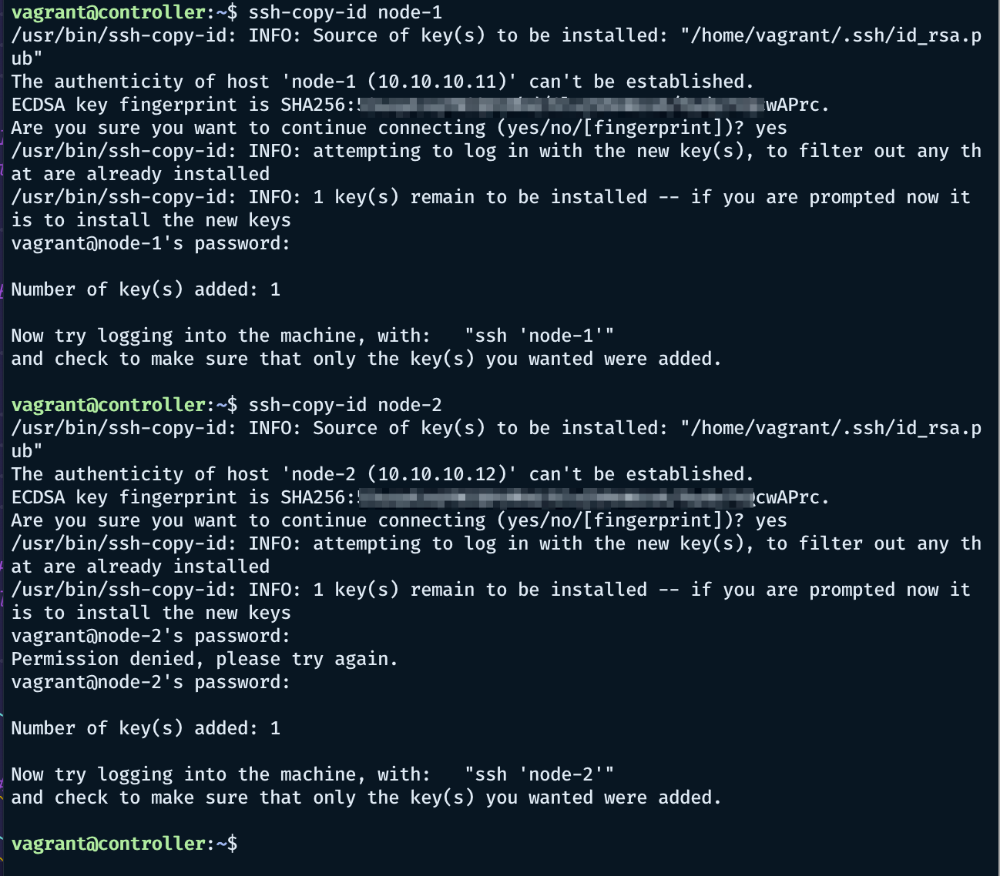
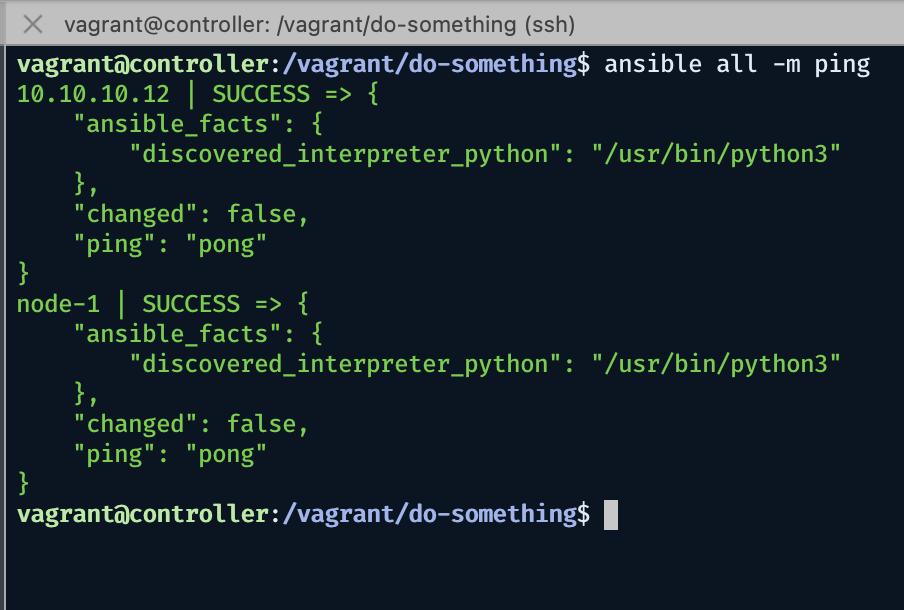

Setting up
---

Need an ARM-based image for VMWare Fusion Tech Preview

From Hashicorp these are the publicly avaiable boxes — https://app.vagrantup.com/boxes/search?utf8=%E2%9C%93&sort=downloads&provider=vmware&q=arm

I chose the following these two

- rkrause/ubuntu-21.10-arm64
- bytesguy/ubuntu-server-21.10-arm64

I prefer to use the first one just because it is faster to boot.

Quick try

```
vagrant init rkrause/ubuntu-21.10-arm64 \
  --box-version 1.0.0
vagrant up
```

VM Setup: 1 controller and some nodes

```ruby
# -*- mode: ruby -*-
# vi: set ft=ruby :
Vagrant.configure("2") do |config|
  config.vm.define "controller" do |controller|
    controller.vm.box = "rkrause/ubuntu-21.10-arm64"
    controller.vm.box_version = "1.0.0"
    controller.vm.hostname = "controller"
    controller.vm.network "private_network", ip: "10.10.10.10"
    controller.vm.provider :vmware_desktop do |vmware|
        vmware.vmx["memsize"] = "512"
        vmware.vmx["numvcpus"] = 1
    end
  end

  (1..2).each do |i|
    config.vm.define "node-#{i}" do |node|
      node.vm.box_version = "1.0.0"
      node.vm.hostname = "node-#{i}"
      node.vm.network "private_network", ip: "10.10.10.1#{i}"
      node.vm.provider :vmware_desktop do |vmware|
        vmware.vmx["memsize"] = "512"
        vmware.vmx["numvcpus"] = 1
      end
    end
  end
end
```

Booting our VMs

```
vagrant up
Bringing machine 'controller' up with 'vmware_desktop' provider...
Bringing machine 'node-1' up with 'vmware_desktop' provider...
Bringing machine 'node-2' up with 'vmware_desktop' provider...
==> controller: Cloning VMware VM: 'rkrause/ubuntu-21.10-arm64'. This can take some time...
==> controller: Checking if box 'rkrause/ubuntu-21.10-arm64' version '1.0.0' is up to date...
==> controller: Verifying vmnet devices are healthy...
...
==> node-1: Fixed port collision for 22 => 2222. Now on port 2200.
==> node-1: Starting the VMware VM...
==> node-1: Waiting for the VM to receive an address...
...
==> node-2: Machine booted and ready!
==> node-2: Setting hostname...
==> node-2: Configuring network adapters within the VM...
==> node-2: Waiting for HGFS to become available...
==> node-2: Enabling and configuring shared folders...
    node-2: -- /learning-ansible/1-setting-up: /vagrant
```

#### Testing

Check for the status

```
$ vagrant status
Current machine states:

controller                running (vmware_desktop)
node-1                    running (vmware_desktop)
node-2                    running (vmware_desktop)

This environment represents multiple VMs. The VMs are all listed
above with their current state. For more information about a specific
VM, run `vagrant status NAME`.
```

To test if we get everything right, we can ping the nodes from the controller.

```
$ vagrant ssh controller
vagrant@controller:~$ ping -c 4 10.10.10.11
PING 10.10.10.11 (10.10.10.11) 56(84) bytes of data.
64 bytes from 10.10.10.11: icmp_seq=1 ttl=64 time=0.405 ms
64 bytes from 10.10.10.11: icmp_seq=2 ttl=64 time=0.590 ms
64 bytes from 10.10.10.11: icmp_seq=3 ttl=64 time=0.459 ms
64 bytes from 10.10.10.11: icmp_seq=4 ttl=64 time=0.665 ms

--- 10.10.10.11 ping statistics ---
4 packets transmitted, 4 received, 0% packet loss, time 3083ms
rtt min/avg/max/mdev = 0.405/0.529/0.665/0.103 ms
vagrant@controller:~$ ping -c 4 10.10.10.12
PING 10.10.10.12 (10.10.10.12) 56(84) bytes of data.
64 bytes from 10.10.10.12: icmp_seq=1 ttl=64 time=0.931 ms
64 bytes from 10.10.10.12: icmp_seq=2 ttl=64 time=0.283 ms
64 bytes from 10.10.10.12: icmp_seq=3 ttl=64 time=0.611 ms
64 bytes from 10.10.10.12: icmp_seq=4 ttl=64 time=0.564 ms

--- 10.10.10.12 ping statistics ---
4 packets transmitted, 4 received, 0% packet loss, time 3033ms
rtt min/avg/max/mdev = 0.283/0.597/0.931/0.229 ms
vagrant@controller:~$

```


## Setting up Ansible

The following commands can be issued to each of the VMs.

```
sudo apt-get update
sudo apt-get install software-properties-common -y
sudo apt-add-repository ppa:ansible/ansible
sudo apt-get update
sudo apt-get install ansible -y
```

Check Ansible 

```
vagrant@controller:~$ ansible --version
ansible [core 2.12.1]
  config file = /etc/ansible/ansible.cfg
  configured module search path = ['/home/vagrant/.ansible/plugins/modules', '/usr/share/ansible/plugins/modules']
  ansible python module location = /usr/lib/python3/dist-packages/ansible
  ansible collection location = /home/vagrant/.ansible/collections:/usr/share/ansible/collections
  executable location = /usr/bin/ansible
  python version = 3.9.7 (default, Sep 10 2021, 14:59:43) [GCC 11.2.0]
  jinja version = 2.11.3
  libyaml = True
vagrant@controller:~$
```

Check Ansible configuration

```
vagrant@controller:~$ cd /etc/ansible/
vagrant@controller:/etc/ansible$ ls
ansible.cfg  hosts  roles
vagrant@controller:/etc/ansible$ cat ansible.cfg
# Since Ansible 2.12 (core):
# To generate an example config file (a "disabled" one with all default settings, commented out):
#               $ ansible-config init --disabled > ansible.cfg
#
# Also you can now have a more complete file by including existing plugins:
# ansible-config init --disabled -t all > ansible.cfg

# For previous versions of Ansible you can check for examples in the 'stable' branches of each version
# Note that this file was always incomplete  and lagging changes to configuration settings

# for example, for 2.9: https://github.com/ansible/ansible/blob/stable-2.9/examples/ansible.cfg

vagrant@controller:/etc/ansible$ cat hosts
# This is the default ansible 'hosts' file.
#
# It should live in /etc/ansible/hosts
#
#   - Comments begin with the '#' character
#   - Blank lines are ignored
#   - Groups of hosts are delimited by [header] elements
#   - You can enter hostnames or ip addresses
#   - A hostname/ip can be a member of multiple groups

# Ex 1: Ungrouped hosts, specify before any group headers:

## green.example.com
## blue.example.com
## 192.168.100.1
## 192.168.100.10

# Ex 2: A collection of hosts belonging to the 'webservers' group:

## [webservers]
## alpha.example.org
## beta.example.org
## 192.168.1.100
## 192.168.1.110

# If you have multiple hosts following a pattern, you can specify
# them like this:

## www[001:006].example.com

# Ex 3: A collection of database servers in the 'dbservers' group:

## [dbservers]
##
## db01.intranet.mydomain.net
## db02.intranet.mydomain.net
## 10.25.1.56
## 10.25.1.57

# Here's another example of host ranges, this time there are no
# leading 0s:

## db-[99:101]-node.example.com

```

#### Exchange SSH keys



### Setup Ansible known hosts

Recommended is to do project-wise.
Create a project folder and manage resources by folders.

```
vagrant@controller:/vagrant/do-something$ cat ansible.cfg
# Since Ansible 2.12 (core):
# To generate an example config file (a "disabled" one with all default settings, commented out):
#               $ ansible-config init --disabled > ansible.cfg
#
# Also you can now have a more complete file by including existing plugins:
# ansible-config init --disabled -t all > ansible.cfg

# For previous versions of Ansible you can check for examples in the 'stable' branches of each version
# Note that this file was always incomplete  and lagging changes to configuration settings

# for example, for 2.9: https://github.com/ansible/ansible/blob/stable-2.9/examples/ansible.cfg
vagrant@controller:/vagrant/do-something$ ansible-config init --disabled > ansible.cfg
vagrant@controller:/vagrant/do-something$  # edit ansible.cfg to set hosts
vagrant@controller:/vagrant/do-something$ cat ansible.cfg | grep -e "inventory = "
inventory = hosts
# And edit hosts 
vagrant@controller:/vagrant/do-something$ cat hosts
node-1
10.10.10.12
```

Testing ansible


